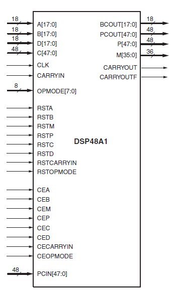
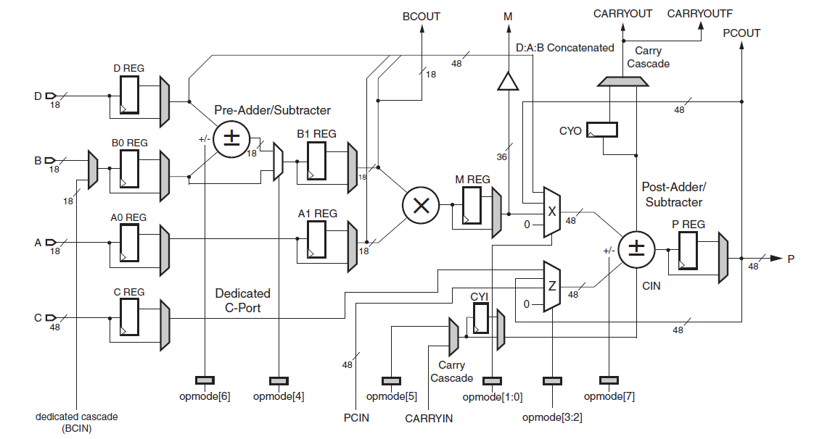

# Spartan6-DSP48A1
 
## Project Overview
The Spartan-6 DSP48A1 slice is a powerful and flexible digital signal processing (DSP) component within the Xilinx Spartan-6 FPGA family. It is designed to handle high-performance arithmetic operations, making it ideal for a variety of DSP applications.

### Features
- **Arithmetic Operations**: The project demonstrates the use of the DSP48A1 slice for performing multiplication, addition, subtraction, and accumulation.
- **Pipelining**: The design is optimized for high-speed operation by leveraging the pipelining capabilities of the DSP48A1 slice.
- **Customizable Parameters**: Parameters such as bit-widths, operation modes, and pipeline depth can be easily modified to suit different application requirements.

### Project Structure

- **/Source**: Contains the Verilog source files implementing the DSP48A1-based modules and the testbench file for simulating and verifying the functionality of the DSP modules also the run_me.do for automation.

- **/Constraints**: Contains the Constraint files for the Basys 3 Artix-7™ FPGA, specifying timing.

- **/Netlist**: Contains the netlist file generated by vivado.